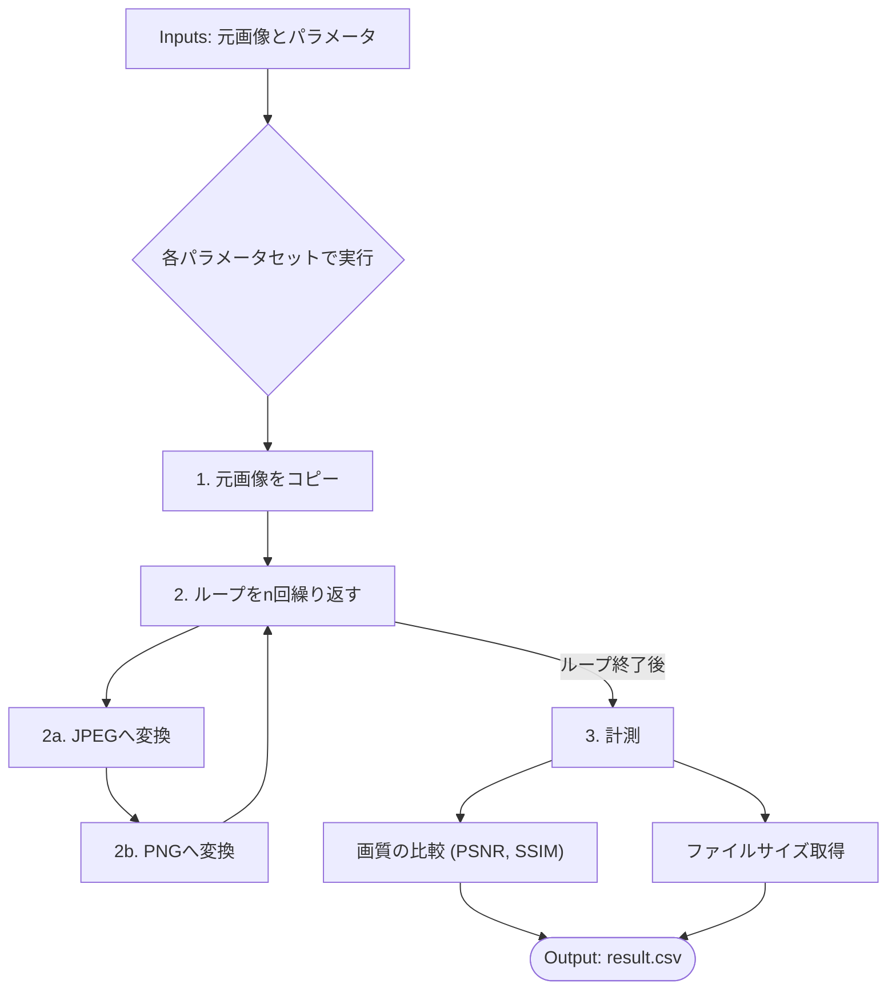

## はじめに
JPEGを上書き保存し続けると画像が劣化する"という話を聞いたことがありますか？では、一体何回繰り返すと、どのくらい劣化するのでしょうか？
今回はその劣化の限界を探るため、jpgで画像コーデックを何度も再圧縮し続けて品質の劣化を観測します。

## マシンスペック
MacBook Air M2 arm64

## 事前知識
### 可逆圧縮
圧縮したデータを解凍する際に、データを元に戻せる場合は可逆圧縮と言います。品質の劣化がなく、元に戻せることです。

### 非可逆圧縮
圧縮したデータを解凍する際に、一部のデータが欠損してしまう（＝元に戻らない）ことです。

### 今回の実験


## 準備
### Dockerの準備
今回はDocker上で実施します。任意のディレクトリにDockerfileを作成します。
```docker
FROM ubuntu:24.04

RUN apt-get update && \
    DEBIAN_FRONTEND=noninteractive apt-get install -y \
        imagemagick webp libavif-bin gnuplot parallel \
        python3 python3-pip && \
    pip3 install --no-cache-dir --break-system-packages \
        scikit-image pandas matplotlib seaborn && \
    rm -rf /var/lib/apt/lists/*

WORKDIR /ws
CMD ["bash"]
```
作成後、ビルドをして接続します。
```bash
docker build -t codec-bench .
docker run -it -v "$PWD":/ws codec-bench
```
プロジェクトのルートの直下は下記のようなディレクトリ配置とします。
```bash
codec_bench/
├── sample.png             # ベンチマーク対象の画像（png）
├── sample.jpg             # ベンチマーク対象の画像（jpeg）
├── mini_codec_bench.py    # ベンチマークスクリプト
├── visualize_benchmark.py # 可視化用のスクリプト
└── grid.sh                # 総当たり実行用ランチャ
```
### ソースコードの準備
#### mini_codec_bench.py 
```python
#!/usr/bin/env python3
import argparse, subprocess, tempfile, csv, os, sys
from pathlib import Path
from skimage import io, metrics

# 各コーデックに正しい拡張子を定義
CODECS = {
    "png":  {"ext": ".png",
             "enc": lambda q, inf, outf: ["convert", inf, "-strip", outf],
             "dec": lambda inf, outf: ["cp", inf, outf]},
    "jpeg": {"ext": ".jpg",
             "enc": lambda q, inf, outf: ["convert", inf, "-quality", str(q), "-strip", outf],
             "dec": lambda inf, outf: ["convert", inf, outf]},
    "webp": {"ext": ".webp",
             "enc": lambda q, inf, outf: ["cwebp", "-q", str(q), inf, "-o", outf],
             "dec": lambda inf, outf: ["dwebp", inf, "-o", outf]},
    "webpl": {"ext": ".webp",
              "enc": lambda q, inf, outf: ["cwebp", "-lossless", "-z", "4", inf, "-o", outf],
              "dec": lambda inf, outf: ["dwebp", inf, "-o", outf]},
    "avif": {"ext": ".avif",
             "enc": lambda q, inf, outf: ["avifenc", "--min", str(q), "--max", str(q),
                                          "--speed", "6", inf, outf],
             "dec": lambda inf, outf: ["avifdec", inf, outf]},
}

def encode(codec, q, inf, outf):
    subprocess.run(CODECS[codec]["enc"](q, inf, outf),
                   check=True, stdout=subprocess.DEVNULL, stderr=subprocess.DEVNULL)

def decode(codec, inf, outf):
    subprocess.run(CODECS[codec]["dec"](inf, outf),
                   check=True, stdout=subprocess.DEVNULL, stderr=subprocess.DEVNULL)

def psnr_ssim(orig, recon):
    a, b = io.imread(orig), io.imread(recon)
    psnr = metrics.peak_signal_noise_ratio(a, b, data_range=255)
    ssim = metrics.structural_similarity(a, b, channel_axis=-1, data_range=255) # data_rangeを追加するとより安定します
    return psnr, ssim

def bench(basename, orig, codec, q, n, writer):
    # 中間ファイルは常に可逆のPNGとして扱う
    tmp_in  = Path(tempfile.mktemp(suffix=".png"))
    
    # 出力用一時ファイルに、コーデックごとの正しい拡張子を付与
    tmp_out = Path(tempfile.mktemp(suffix=CODECS[codec]["ext"]))

    # 最初の画像(orig)からスタート
    tmp_in.write_bytes(Path(orig).read_bytes())

    # n世代分、エンコードとデコードを繰り返す
    for _ in range(n):
        encode(codec, q, tmp_in, tmp_out)
        decode(codec, tmp_out, tmp_in) # デコード後は必ずPNG(tmp_in)に戻る

    size  = tmp_out.stat().st_size
    psnr, ssim = psnr_ssim(orig, tmp_in)

    writer.writerow([basename, codec, q, n, size, psnr, ssim])
    
    # 一時ファイルをクリーンアップ
    tmp_in.unlink()
    tmp_out.unlink()

if __name__ == "__main__":
    ap = argparse.ArgumentParser()
    ap.add_argument("image")
    ap.add_argument("--basename")
    ap.add_argument("--codec")
    ap.add_argument("--q", type=int)
    ap.add_argument("--n", type=int)
    args = ap.parse_args()

    # CSVファイルへの追記はスレッドセーフではないため、
    # このスクリプトは1回ずつ呼ばれる前提（parallelがうまくやってくれる）
    with open("result.csv", "a", newline="") as f:
        bench(args.basename, args.image, args.codec, args.q, args.n, csv.writer(f))
```
#### grid.sh
```bash
#!/usr/bin/env bash
set -euo pipefail

# --- 入力ファイルの準備 ---
# PNGのベンチマークには高品質なPNG元画像を使用
PNG_SOURCE="sample.png"
# JPEGのベンチマークには、あらかじめ用意したJPEG元画像を使用
JPEG_SOURCE="sample.jpg"

# パラメータ設定
QUALS=(10 30 50 70 90)
GENS=(1 3 5 10 25 50 75 100)

# --- 実行 ---
# 既存の結果ファイルを空にし、ヘッダーを書き込む
> result.csv
echo "codec,q,n,size,psnr,ssim" > result.csv

# --- PNGのベンチマークを実行 ---
echo "--- Benchmarking for PNG (Lossless) using $PNG_SOURCE ---"
# PNGは品質(q)の概念がないので、ダミーとしてq=100を1回だけ渡す
parallel --bar -j$(nproc) \
  "python3 mini_codec_bench.py '$PNG_SOURCE' --codec png --q 100 --n {1}" \
  ::: "${GENS[@]}"

# --- JPEGのベンチマークを実行 ---
echo "--- Benchmarking for JPEG (Lossy) using $JPEG_SOURCE ---"
parallel --bar -j$(nproc) \
  "python3 mini_codec_bench.py '$JPEG_SOURCE' --codec jpeg --q {1} --n {2}" \
  ::: "${QUALS[@]}" ::: "${GENS[@]}"

echo "全てのベンチマークが完了しました。"
```
#### visualize_benchmark.py 
```python
import pandas as pd
import matplotlib.pyplot as plt
import seaborn as sns
import japanize_matplotlib # 日本語の文字化けを防ぐ

def create_degradation_curve(csv_path: str):
    """
    ベンチマーク結果のCSVを読み込み、JPEGの品質別・世代劣化カーブを描画する。
    """
    try:
        df = pd.read_csv(csv_path)
        print("✅ CSVファイルの読み込みに成功しました。")

        # JPEGデータのみを抽出
        df_jpeg = df[df['codec'] == 'jpeg']
        if df_jpeg.empty:
            print("⚠️ JPEGデータが見つからないため、グラフ作成をスキップします。")
            return

        # --- グラフ描画 ---
        print("品質ごとの世代劣化カーブを作成中...")
        plt.figure(figsize=(12, 8))

        sns.lineplot(
            data=df_jpeg, 
            x="n", 
            y="ssim",
            hue="q", # 品質(q)ごとに色分け
            palette='viridis', 
            marker='o', 
            markersize=8
        )

        plt.title('JPEGの品質(q)別 世代劣化カーブ', fontsize=16)
        plt.xlabel('圧縮世代 (n)', fontsize=12)
        plt.ylabel('SSIM - 1.0に近いほど良い', fontsize=12)
        
        # X軸の目盛りを、データに存在する世代数に合わせる
        plt.xticks(sorted(df['n'].unique()))
        
        plt.grid(True, which="both", ls="--", alpha=0.6)
        plt.legend(title='品質(q)')
        plt.tight_layout()
        
        output_filename = 'plot_degradation_by_quality.png'
        plt.savefig(output_filename)
        
        print(f"✅ グラフを '{output_filename}' として保存しました。")
        plt.close()

    except FileNotFoundError:
        print(f"エラー: ファイル '{csv_path}' が見つかりません。")
    except Exception as e:
        print(f"エラーが発生しました: {e}")

if __name__ == '__main__':
    create_degradation_curve('result.csv')
```
### 画像の準備
趣味で撮影した写真を使用します。
#### png

#### jpg


## 実験
Dockerに入り、下記コマンドを実行します。
```bash
chmod +x grid.sh
./grid.sh
```
## 結果


## まとめ

#### 高画質設定（q=90, 70）
グラフの一番上にある線です。初回圧縮のの画質（SSIM）は非常に高いですが、再圧縮を繰り返すたびに着実に画質が低下し続けます。
高品質ですが、劣化しないわけではありません。編集や保存を繰り返す用途には向いていないことがわかります。また、他のものと比べて品質の劣化は繰り返すごとに増えていることもわかります。

#### 中画質設定（q=50）
グラフの中央の線です。最初から劣化をしており、その後も圧縮解凍を繰り返すごとに緩やかに劣化を続けます。複数回の再保存には耐えられません。

#### 低画質設定（q=30, 10）
グラフの一番下にある線です。最初の1回の圧縮で画質が劇的に損なわれ、SSIMの値が大きく低下します。しかし、一度大きく劣化して失う情報がなくなった後は、何度再圧縮してもほとんどそれ以上は劣化しないとい特性が見受けられます。