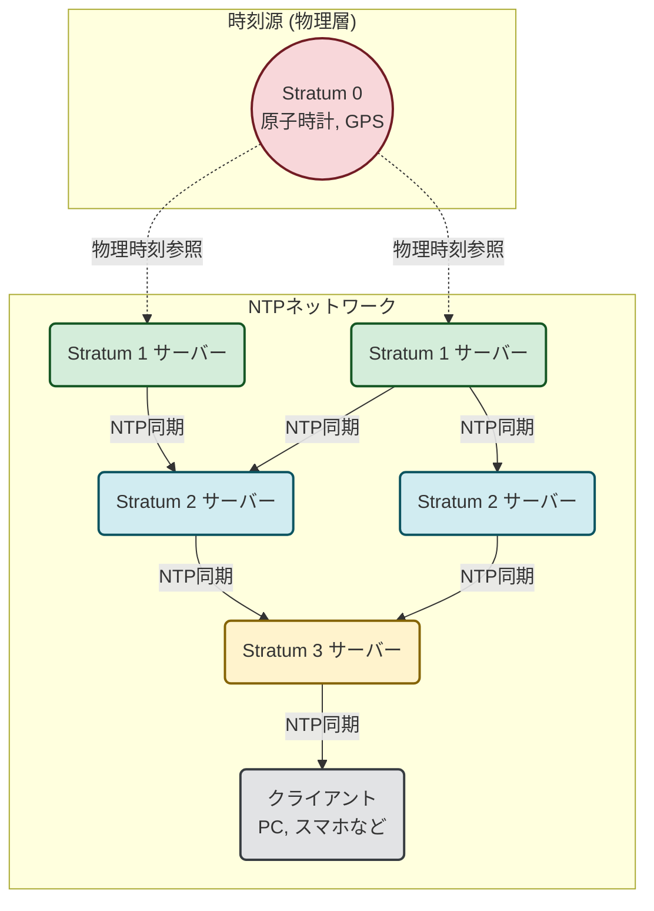

## はじめに
普段、NTPはあまり意識しないプロトコルですが、重要なプロトコルです。
今回は、RustでNTPクライアントを自作して理解を深めます。

## マシンスペック
MacBook Air M2 arm64

## 事前知識
### NTPとは？
NTPはNetwork Time Protocolと言い、ネットワークに接続される機器の時刻を同期するためのプロトコルです。
NTPサーバに同期していない機器は時刻が正確ではありません。インターネットから切り離された状態でOSのセットアップを行うと、日時や時刻が適当なものになります。
プライベート用の端末で時刻を気にしなければ問題はないのですが、SaaSをはじめとしたサービスを提供している場合、ログの時刻がそれぞれのサーバで別々であった場合に時系列で状況を追うことが困難になり問題となります。どういった事象がどの時刻に発生したか、という情報を正確に把握するためにNTPサーバと同期して正確な時間を設定します。



## 準備
### Dockerfileの準備・接続
```bash
mkdir -p ntp-client && cd ntp-client
```
```docker
# 最新のRust公式イメージをベースにする
FROM rust:latest

# パッケージリストを更新し、vimをインストールする
# -yオプションで対話的な確認をスキップする
RUN apt-get update && apt-get install -y vim

# コンテナ内の作業ディレクトリを指定
WORKDIR /work

# コンテナ起動時のデフォルトコマンド
CMD ["bash"]
```
### Rust環境の整備
```bash
docker build -t ntp-client-dev .
docker run -it --rm -v "$(pwd)":/work ntp-client-dev
cargo init .
vim Cargo.toml
```
下記のように`dependencies`に`chrono`を追記します。
```toml
[package]
name = "work"
version = "0.1.0"
edition = "2024"

[dependencies]
chrono = "0.4"
```
### ソースコードの作成
```rust
# src/main.rs
use std::net::UdpSocket;
use chrono::{DateTime, Utc};

struct NtpPacket {
    data: [u8; 48],
}

impl NtpPacket {
    fn new_request() -> Self {
        let mut data = [0u8; 48];
        data[0] = 0x23; // LI=0, VN=4, Mode=3
        Self { data }
    }

    fn get_transmit_timestamp(&self) -> u64 {
        let bytes: [u8; 8] = self.data[40..48].try_into().unwrap();
        u64::from_be_bytes(bytes)
    }

    fn to_datetime(ntp_timestamp: u64) -> DateTime<Utc> {
        let ntp_seconds = (ntp_timestamp >> 32) as u32;
        const NTP_UNIX_EPOCH_DIFF: u32 = 2_208_988_800;
        let unix_seconds = ntp_seconds.saturating_sub(NTP_UNIX_EPOCH_DIFF);
        DateTime::from_timestamp(unix_seconds as i64, 0).unwrap()
    }
}

fn main() -> std::io::Result<()> {
    println!("--- Rust NTP Client (running in Docker) ---");
    let request_packet = NtpPacket::new_request();
    let socket = UdpSocket::bind("0.0.0.0:0")?;
    socket.connect("time.google.com:123")?;
    println!("Sending NTP request to time.google.com...");
    socket.send(&request_packet.data)?;
    let mut response_packet = NtpPacket { data: [0u8; 48] };
    socket.recv_from(&mut response_packet.data)?;
    println!("Received NTP response.");
    let transmit_timestamp = response_packet.get_transmit_timestamp();
    let datetime = NtpPacket::to_datetime(transmit_timestamp);
    println!("\n--- Time Sync Result ---");
    println!("NTP Server Time (UTC): {}", datetime);
    let system_time = Utc::now();
    println!("Container Time (UTC):  {}", system_time);
    let diff = system_time.signed_duration_since(datetime);
    println!("\nSystem clock is off by: {} ms", diff.num_milliseconds());
    Ok(())
}
```

## 実験
```bash
cargo run
   Compiling work v0.1.0 (/work)
    Finished `dev` profile [unoptimized + debuginfo] target(s) in 0.22s
     Running `/work/target/debug/work`
--- Rust NTP Client (running in Docker) ---
Sending NTP request to time.google.com...
Received NTP response.

--- Time Sync Result ---
NTP Server Time (UTC): 2025-07-06 07:34:21 UTC
Container Time (UTC):  2025-07-06 07:34:21.256380341 UTC

System clock is off by: 256 ms
```

### まとめ
今回はNTPについて深めました、皆様の学習の一助になれば幸いです。