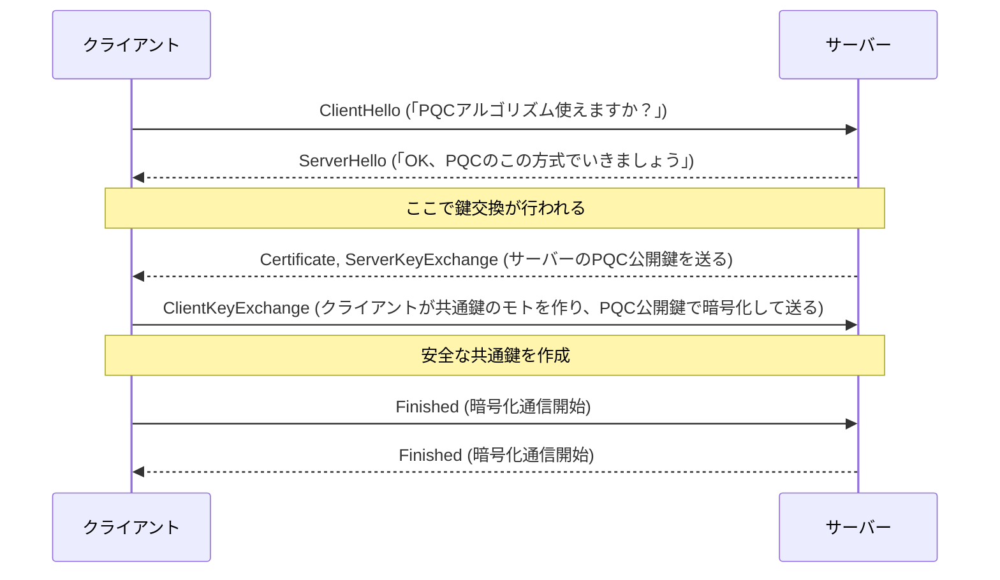

## はじめに
量子コンピュータの台頭により、現在のTLSが使用する楕円曲線暗号（ECC）が将来的なリスクにさらされています。ポスト量子暗号（PQC）を用いた次世代TLSは、その耐性を持つ一方で、導入時には運用負荷が高まると言われています。
[AWSも移行計画](https://aws.amazon.com/jp/blogs/news/aws-post-quantum-cryptography-migration-plan/)があり、今回は単純な起動や接続・レイテンシの観点で記事を書きます。

本記事はGiHubで公開されている[oqs-provider](https://github.com/open-quantum-safe/oqs-provider?utm_source=chatgpt.com)や[oqs-demos](https://github.com/open-quantum-safe/oqs-demos)を参考・利用しています。


## マシンスペック
MacBook Air M2 arm64

## 事前知識
PQCはTLSのどこで使われるのかを下記で図示します。

この図と共に、「TLSハンドシェイクにおける鍵交換の部分で、PQCが使われます。今回は、既存のECC（x25519）とPQC（mlkem768）を組み合わせたハイブリッド方式を試します」と解説します。

## 事前準備
ポスト量子暗号の研究を進めるOpen Quantum Safe (OQS) プロジェクトが、PQCを組み込んだOpenSSLと便利なDockerイメージを公開していますので、今回はこれを活用していきます。

### Docker準備

```bash
docker pull openquantumsafe/oqs-ossl3:latest
docker run --rm -it --network host openquantumsafe/oqs-ossl3:latest
```

対話式でコンテナ内でコマンドを実行できるため、以下を確認します

```bash
openssl version
# e.g. OpenSSL 3.4.0 22 Oct 2024 (Library: OpenSSL 3.4.0 22 Oct 2024)
openssl list -providers | grep oqsprovider
# oqsprovider
openssl list -kem-algorithms
# 複数のアルゴリズムが出てくればOK
```

## 実験
下記にハイブリッドとECC単独、2つのサーバー起動コマンドを提示します。

### サーバー用のコンテナの起動
#### ハイブリッド（X25519 + ML-KEM768）
```bash
docker run --rm -d --name pqc-server -p 8433:8433 \
  openquantumsafe/oqs-ossl3:latest /bin/sh -c '\
    openssl req -x509 -newkey ec -pkeyopt ec_paramgen_curve:P-256 \
      -nodes -days 1 -keyout /tmp/key.pem -out /tmp/cert.pem -subj "/CN=localhost" && \
    openssl s_server -port 8433 \
      -cert /tmp/cert.pem -key /tmp/key.pem \
      -groups x25519:mlkem768'
```
#### ECC 単独（X25519）
```bash
docker run --rm -d --name pqc-server -p 8433:8433 \
  openquantumsafe/oqs-ossl3:latest /bin/sh -c '\
    openssl req -x509 -newkey ec -pkeyopt ec_paramgen_curve:P-256 \
      -nodes -days 1 -keyout /tmp/key.pem -out /tmp/cert.pem -subj "/CN=localhost" && \
    openssl s_server -port 8433 \
      -cert /tmp/cert.pem -key /tmp/key.pem \
      -groups x25519'
```
ACCEPTという文字が確認できればOKです。


### 自己署名証明書をホストへコピー
```bash
docker cp pqc-server:/tmp/cert.pem ./cert.pem
```
### クライアント接続（ハイブリッド鍵交換）
別のターミナルで実施します。
```bash
docker run --rm -it -v "$(pwd)/cert.pem:/cert.pem:ro" \
  openquantumsafe/oqs-ossl3:latest /bin/sh -c \
  "openssl s_client -groups x25519:mlkem768 \
     -connect host.docker.internal:8433 \
     -CAfile /cert.pem -quiet < /dev/null"
```

### 性能解析
#### レイテンシ10回平均比較
```bash
for i in {1..10}; do
  /usr/bin/time -p openssl s_client -groups x25519:mlkem768 \
    -connect host.docker.internal:8433 -CAfile cert.pem -quiet </dev/null 2>&1
done | awk '/^real/ {sum+=$2; n++} END {printf "平均遅延(sec): %.6f\n", sum/n}'
# 平均遅延(sec): 0.003000
```

```bash
for i in {1..10}; do
  /usr/bin/time -p openssl s_client -groups x25519 \
    -connect host.docker.internal:8433 -CAfile cert.pem -quiet </dev/null 2>&1
done | awk '/^real/ {sum+=$2; n++} END {printf "平均遅延(sec): %.6f\n", sum/n}'
# 平均遅延(sec): 0.007000
```
## 結果
今回は、双方のアルゴリズムでレイ天使が数ミリ秒のみ変わる結果となりました。これはマシンスペックや実行環境にも依存すると考えられますが、PQCを利用したアルゴリズムでも現行のTLSと遜色ないパフォーマンスが期待でき、さらに耐量子性が兼ね備えられることがわかりました。

## まとめ
量子コンピュータの計算速度を考えると、現状のアルゴリズムは解読されてしまう懸念があり、今後移行計画のポスト量子暗号（PQC）を簡単に試しました。
もう少し深掘りした記事も考えていますので、興味ある方はよろしくお願いします。