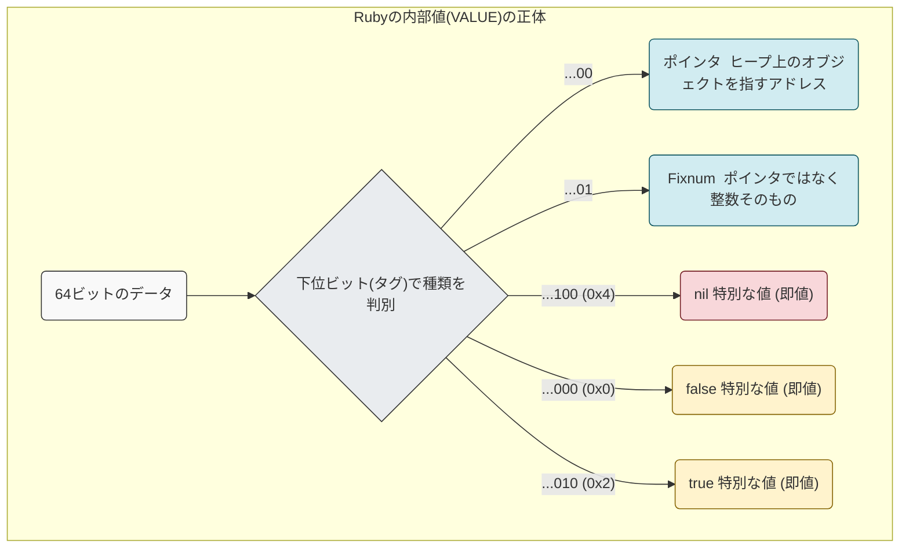

## はじめに
Rubyでnilを見た時に「Nullなのか？」という疑問を持っていて、今回掘り下げてみました。

## マシンスペック
MacBook Air M2 arm64

## 事前知識
### Null
Nullは「何も示さない」ことを意味します。何も示さない領域を参照するとNullポインタアクセスとなります。無の様なイメージです。

### ポインタ
ポインタとは、変数や関数などのアドレス番地を指すものとなります。
関数や配列の場合は、メモリの確保した領域の先頭のアドレスを指します。多次元配列になると少し参照の仕方も解説が必要ですが、今回は割愛します。
下図は簡易図となっており、`int a = 1;`を定義すると、メモリの0x0000_XXX1番地に記録されると仮定します。その後、bをポインタ型として定義し、&aでaを参照すると、bはaのアドレス番地を指すこととなります。


### Nullポインタ
上記のポインタの考え方から、Nullを参照するとどうなるでしょうか？Nullは何もない状態なのでコンピュータは参照先がわからずにクラッシュしたり意図しない挙動をすることが考えられます。
そのため、C言語でNullチェックを行ったり、高級言語ではNullPointerExceptionの例外が実装されていたり、Nullの取り扱いには注意が必要になります。

### タグ付きポインタ
Rubyでは、整数や真偽値(true/false)、nilもオブジェクトです。
しかし、上記を使うたびにやメモリを確保すると、Ruby自体の動作が非常に遅くなります。
そこでRuby（特にCRuby）は、ポインタとして使われる値の下位の数ビットをタグとして使い、値の種類を判別するという方法を採っています。
これをタグ付きポインタと呼びます。

ポインタは通常、8バイト単位でアライメントされるため、そのアドレスの下位3ビットは常に0になります。
Rubyはこの空き地をタグとして有効活用し、よく使う値はメモリアドレスではなくこのタグを含んだビットパターン（即値）として直接表現している様です。

## 検証
### C言語でNullを確認
```c
/* null_demo.c */
#include <stdio.h>

int main(void)
{
    void *p = NULL;                       /* C の NULL ポインタ */

    /* アドレスとして表示 */
    printf("NULL as pointer : %p\n", p);

    return 0;
}
```
```bash
gcc null_demo.c -o null_demo
./null_demo
NULL as pointer : 0x0
```
C言語では、Nullのポインタの参照アドレスは0x00であることがわかりました。

### RubyでNullを確認
一方でrubyではnilはどのアドレス番地を指しているのでしょうか？
下記のコードで確認してみます。
```ruby
# null.rb
p "NULL as pointer : 0x#{nil.object_id.to_s(16)}"
```
```bash
ruby null.rb
"NULL as pointer : 0x4"
```
Rubyのnilの参照アドレス番地は0x04と表示されています。
実際には “0x04 というビット列を即値として採用されていることが後述でわかります。
## Rubyのnilの深掘り
### コードから追う
[こちら](https://github.com/ruby/ruby/blob/917beef327117cfeee4e1f455d650f08c2268d7e/include/ruby/ruby.h#L420)にdefineがありました。
RubyVMが何も指さないことを示すタグ付き即値であることのようです。
### 意図的にNullポインタにアクセスして操作する
```ruby
require 'fiddle'
ptr = Fiddle::Pointer.new(4)   # 0x4 を指すダミーポインタ
puts ptr[0, 1]                 # ここで memmove して即 SEGV
```

```bash
nulpo.rb:4: [BUG] Segmentation fault at 0x0000000000000004
ruby 3.4.4 (2025-05-14 revision a38531fd3f) +PRISM [arm64-darwin24]

-- Crash Report log information --------------------------------------------
   See Crash Report log file in one of the following locations:             
     * ~/Library/Logs/DiagnosticReports                                     
     * /Library/Logs/DiagnosticReports                                      
   for more details.
```
クラッシュしました。nullポインタへの操作はできない様です。これは0x4は有効なメモリアドレスではなく、OSにアクセスを拒否されたということがわかります。

## まとめ
Rubyのnilは「0x04 というタグ付き即値」であり、実在メモリ0x04を指しているわけではない。
外部ライブラリで0x04をポインタとして扱うと、未マップ領域へのアクセスとなるためOSがSIGSEGVで落とす。  