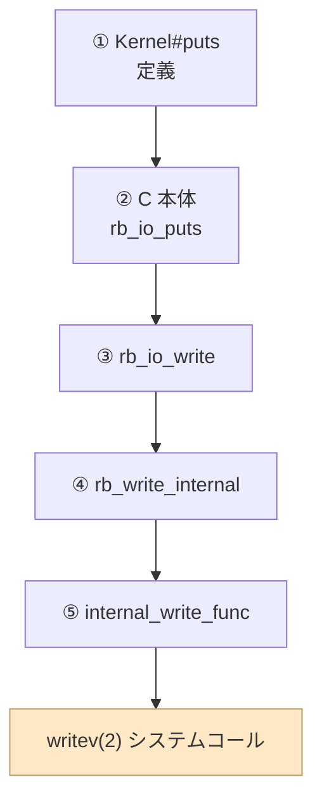
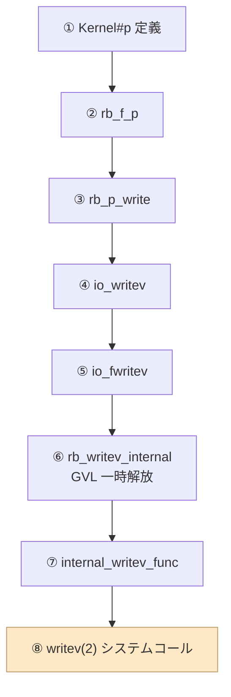

## はじめに
Rubyでデバッグや表示系で使われる'puts'と'p'、例えば下記のケースではhelloが返ってきますが、内部的にはどの様になっているのでしょうか？
今回は'puts'と'p'の深掘りを簡単に行います。
```ruby
$ puts "hello"
hello
$ p "hello"
"hello"
```
結果としては両関数とも、writeシステムコールが呼ばれていましたが、その呼ばれ方が異なることがわかりました。
C言語で書かれているRubyですが、printfは使用されずに標準出力機能が実装されていることがわかりました。

## マシンスペック
MacBook Air M2 arm64
Docker上でUbutnu24.04を立ち上げて実施
### Macから手軽にubuntu仮想環境に入る方法
```bash
# Dockerfileを作成してビルド
docker build -t ruby-syscall - <<'EOF'
FROM ubuntu:24.04
RUN apt-get update && \
    apt-get install -y --no-install-recommends \
        ruby-full gcc strace linux-tools-common && \
    rm -rf /var/lib/apt/lists/*
WORKDIR /ws
EOF

# コンテナに入る
echo 'puts "hello from puts"; p "hello from p"' > test.rb && \
docker run --privileged -it --rm -v "$PWD/test.rb":/ws/test.rb ruby-syscall
```

## 事前知識
### システムコール
本記事ではシステムコールを取り扱います。システムコールとは、OSの機能を呼び出すための機構です。我々が普段使用している高級言語で標準出力に文字を出したり、ファイルのI/Oを制御する際にコードの深いところではシステムコールが呼び出されています。
簡単なイメージとしては下記のように表され、アプリケーションコードはカーネル空間にはアクセスせずに、システムコールを使用してOS, HWとやりとりをします。
厳密には言葉の定義が異なるかもしれませんが、インターフェースのような役割を持っています。


## 検証
### straceで見てみる
単純にstraceで今回使用されているシステムコールとその回数を見てみます。
```ruby
strace -e trace=write ruby test.rb 2>&1 | tee syscall.log | cat

write(1, "hello from puts\n\"hello from p\"\n", 31hello from puts
"hello from p"
) = 31
+++ exited with 0 +++
```
#### syscallのwrite(ARM64)
ここで、引数でwriteをトレースの対象として指定しました。ここの戻り値に'write(...)'とありますが、これはシステムコールのwriteを呼び出していることを示しています。
writeの実体はARM64であれば[ksys_write](https://github.com/torvalds/linux/blob/master/fs/read_write.c#L727)あたりでしょうか。
下記のように引数をとります。
|引数|解説|
|-|-|
|fildes|open()をコールして得られたファイル記述子。これは整数値である。それぞれ、標準入力、標準出力、標準エラーを表す値として、0、1、2を指定することもできる。|
|buf|filedesが指すファイルに書き込まれる内容の文字配列を指す。|
|nbyte|filedesが指すファイルに文字配列bufから書き込むバイト数を指定する。|
> https://en.wikipedia.org/wiki/Write_(system_call)

今回の戻り値は、標準出力に`puts`や`p`で入力した文字列が31バイトとして出力されることがわかります。

## ソースコードを確認する
検証では、writeが呼ばれていることがわかりましたが、実際にはどうなのかを[GitHubのrubyのソースコード](https://github.com/ruby/ruby)から解析します。
### puts
定義自体は[このファイルのL15792](https://github.com/ruby/ruby/blob/master/io.c#L15792)にありました。実体は[こちらにありました](https://github.com/ruby/ruby/blob/master/io.c#L8864)。中身では`rb_io_write`が呼ばれており、[rb_write_internal](https://github.com/ruby/ruby/blob/master/io.c#L1359)も呼ばれています。その先は[internal_write_func](https://github.com/ruby/ruby/blob/master/io.c#L1231C1-L1231C20)となり、[writeシステムコールを呼んで](https://github.com/ruby/ruby/blob/master/io.c#L1243C20-L1243C25)います。

### p
[定義自体はこちらにありました。](https://github.com/ruby/ruby/blob/master/io.c#L15700)実体は[rb_f_p](https://github.com/ruby/ruby/blob/master/io.c#L9123)で、その中に[rb_p_write](https://github.com/ruby/ruby/blob/master/io.c#L9050)、[io_writev](https://github.com/ruby/ruby/blob/master/io.c#L2227)が呼ばれ[io_fwritev](https://github.com/ruby/ruby/blob/master/io.c#L2177)...となり[internal_writev_func](https://github.com/ruby/ruby/blob/master/io.c#L1856)から、[do_write_retry](https://github.com/ruby/ruby/blob/master/io.c#L1274C5-L1274C19)でwriteシステムコール呼ばれています。

### C言語のprintfを使用していない
rubyはC言語で書かれていますが、C言語の標準出力を担う`printf`が使用されておらず、writeシステムコールが呼ばれている作りとなっていました。
今回は説明を割愛しますが、`printf`も同様にwriteシステムコールが使用されています。

## まとめ
今回はrubyの'puts'と'p'の中身を覗いてみました。それぞれは同様に標準出力で使用しますがcallされる時の経路が異なることがわかりました。
また、最終的にはwriteシステムコールが呼ばれていることがわかりました。
